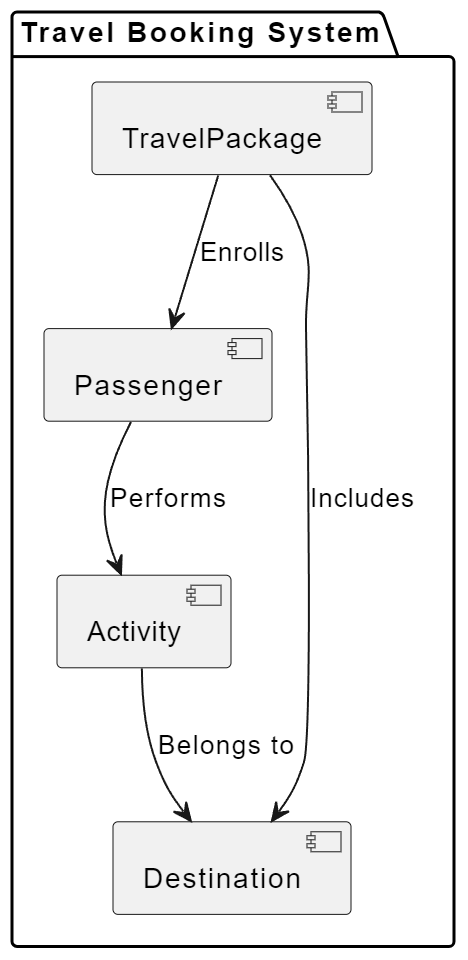

test a software system that allows travel agencies to maintain their travel packages' itinerary and passengers.

# Specification

1. Each travel package has a name, a passenger capacity, an itinerary (list of destinations) and a list of it's passenger.
2. Each destination has a name, and a list of the activities available at that destination.
3. Each activity has a name, a description, a cost and a capacity. Each activity is available at one destination only.
4. Each passenger can sign up for zero or more activity at each destination of the travel package.
5. Once an activity has reached it's capacity no more passengers can sign up for it.
6. Each passenger has a name and a passenger number.
7. A passenger can be a standard, gold or premium passenger.
    1. A standard passenger has a balance. And each time a standard passenger signs up for an activity the cost is deducted from their balance. They cannot sign up for an activity if they do not have sufficient balance.
    2. A gold passenger has a balance. Each time a gold passenger signs up for an activity, a 10% discount is applied on the cost of the activity and the discounted amount is deducted from their balance. They cannot sign up for an activity if they do not have sufficient balance.
    3. A premium passenger can sign up for activities for free.

